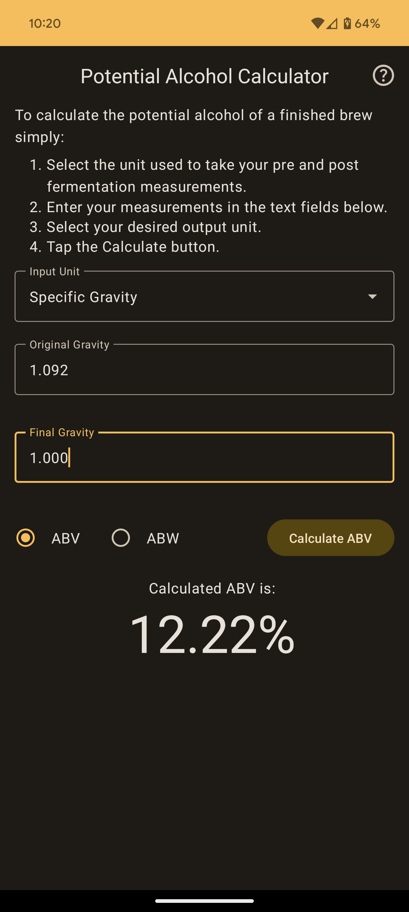
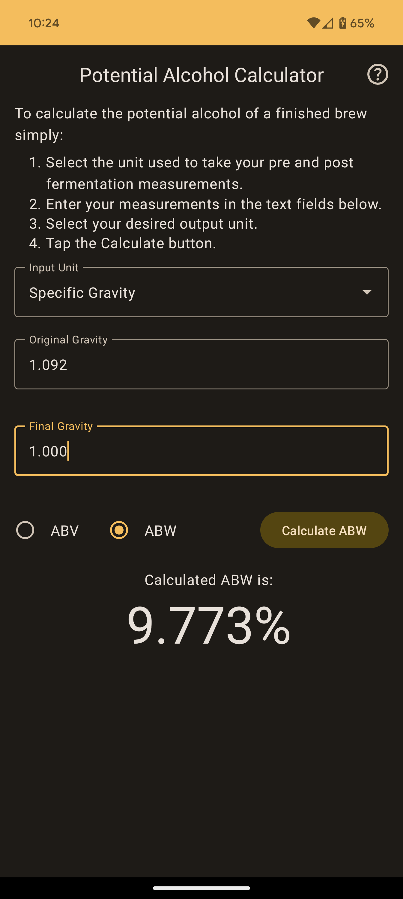
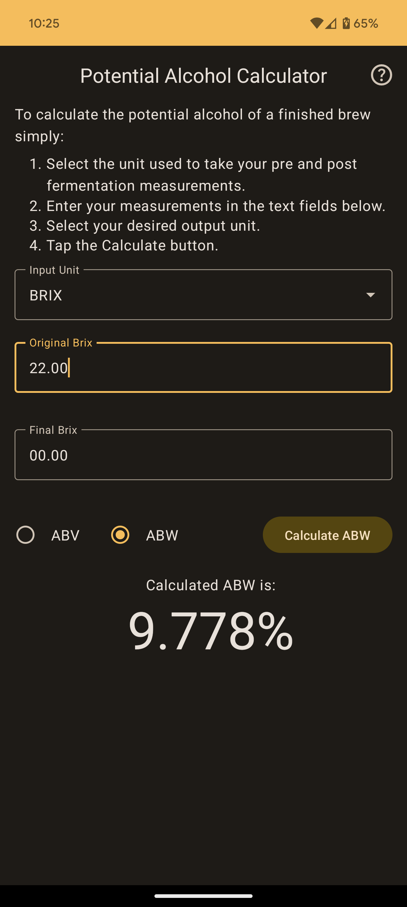
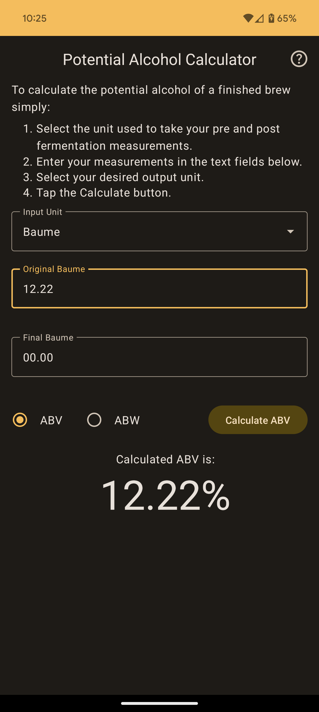
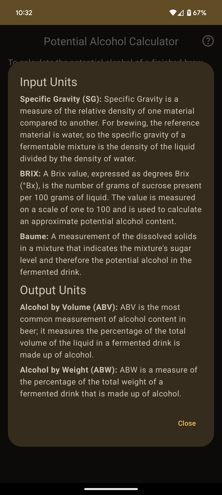

# Mead Brewer's Companion

## About
Mead Brewer's Companion is a simple to use, but powerful tool for all your mead brewing management 
and tracking needs.

No more writing gravity measurements on masking tape, no more fumbling around to find the equations 
you can't quite remember scattered around the internet, no more scrolling through your photos to
find a picture of a specific brew. Mead Brewer's Companion does it all, in one place.

Mead Brewer's Companion is Open Source, and written entirely using Kotlin with UIs created with 
Jetpack Compose.

## Features
### Potential Alcohol Calculator
Easily calculate your Mead's potential Alcohol. Calculations using Specific Gravity, BRIX, or 
Baume measurements are all supported. You can also decide if you want the potential alcohol 
calculated using alcohol by volume (ABV) or alcohol by weight (ABW). If you ever need a quick
reminder about what any of these units mean, there is also a handy help dialog just one tap away.

